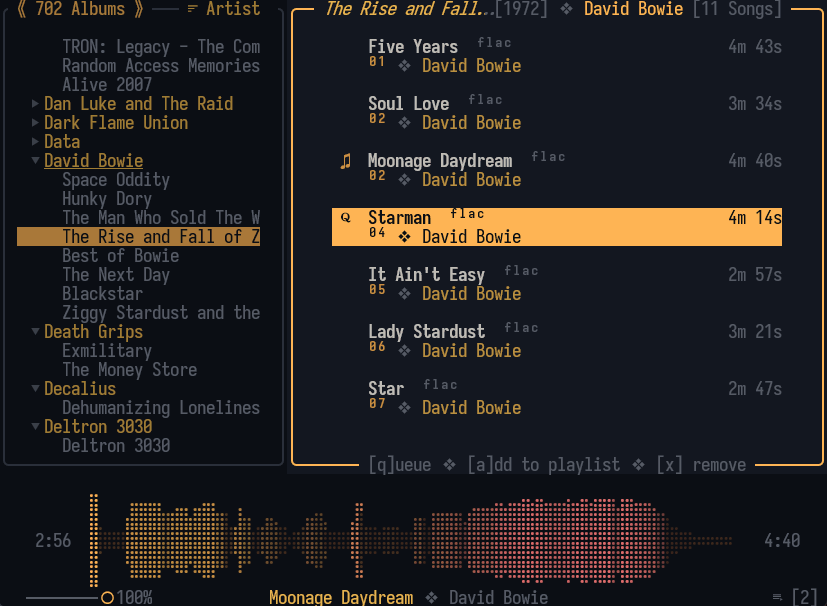
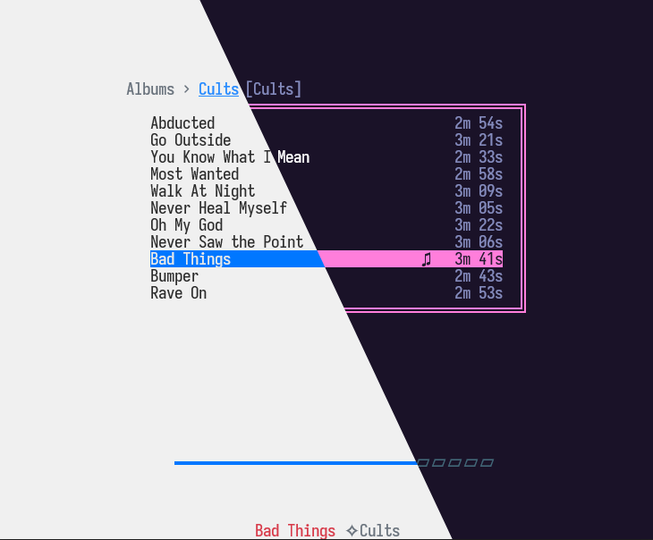

<div align="center">
<h1>NoctaVox
</h1>

[](https://crates.io/crates/noctavox)
[](https://opensource.org/licenses/MIT)
[](https://ratatui.rs) 

**A lightweight, Rust-powered TUI music player designed for local libraries and
terminal workflows.** 
</div>



## Features

- Gapless playback
- Queue support
- Playlist management
- ReplayGain support
- Import/Export Playlists*
- Multi-format audio ```mp3, m4a, wav, flac, ogg, opus, aiff, alac, webm```
- Live library reloading
- Custom theming with hot reload
- Vim-inspired key-bindings
- Single track loop mode
- Minimal-view mode (pictured above)
- Smart search matches against title, album and artist
- Waveform, oscilloscope, and spectrum visualizations
- Integration with system media controls

> ***Note:** Requires plugin

## Installation

##### Prebuilt binaries are available on the [releases page](https://github.com/Jaxx497/NoctaVox/releases).

#### Cargo *(recommended)*
```bash
cargo install noctavox --locked 
```

#### Build Git Version

```bash
git clone https://github.com/Jaxx497/noctavox/
cd noctavox

# Run directly (use the release flag for best audio experience)
cargo run --release 

# Or install globally
cargo install --path .

# and run with the vox command:
vox
```

## Quick Start

Upon the first launch, NoctaVox will prompt the user to set up a root directory
to scan. Roots can be added or removed from this menu at anytime via the `` `
`` or `~` (backtick and tilde) keys.

**Navigation (Scrolling):** `j` `k` or vertical arrow keys  
**Navigation (Panes):** `h` `l` or horizontal arrow keys  
**Playback:** `Space` to toggle playback, `Enter` to play  
**Seeking:** `n` +5 secs, `p` -5 secs  
**Search:** `/`  
**Add to queue**: `q`  
**Reload library:** `F5` or `Ctrl`+`u`  
**Reload theme:** `F6`  
**Toggle minimal mode:** `m`

See the complete [keymap documentation](./docs/keymaps.md) for much more

## Theming



NoctaVox contains a simple and easy to learn theming engine. The most recent
specification for custom theming can be found by refering to the [theme
specification](./docs/themes.md). 

A set of pre-made themes can be installed with the `get-themes` script. No
clone required — the script fetches the latest themes directly from GitHub.

##### Linux / macOS
```bash
curl -fsSL https://raw.githubusercontent.com/Jaxx497/NoctaVox/master/scripts/get-themes.sh | sh
```

##### Windows Powershell
```powershell
irm https://raw.githubusercontent.com/Jaxx497/NoctaVox/master/scripts/get-themes.ps1 | iex
``` 

## Config

NoctaVox allows for global configuration adjustments. This is an in-progress
feature. Default values are supplied if no config file is present or if a field
is missing/invalid. To adjust the configurations, create a `config.toml` file
inside of the `$CONFIG/noctavox/` directory. 

```toml
framerate = 120         # INTEGER | accepts values from 20 to 360 
                        # default: 60 | recommended: monitor hz

history_capacity = 64   # INTEGER | accepts values from 0 to 1024
                        # default: 64

update_on_start = true  # BOOLEAN | auto-update library NoctaVox fires up
                        # default: true

auto_resume = false     # BOOLEAN | if a track was playing when shutdown, resume playback on startup
                        # default: false

replay_gain = "off"     # STRING | accepts [ "track" | "album" | "off" ]
                        # enables reading of ReplayGain tags, specifies which tag to prioritize 
                        # default: off

broadcast = false       # BOOLEAN | enable broadcast features for scrobbling/Discord rich presence addons
                        # default: false

```

## Addons

NoctaVox now supports addons. Official addons can be found in the
[NoctaVox-Plugins](https://github.com/Jaxx497/NoctaVox-Plugins) repository.

Currently, the only official addon is the *Transpose* addon which enables users
to import/export playlists. Once installed, users can invoke the import/export
behavior with the CLI flags:

```bash
vox --import-playlist
vox --export-playlist
vox --list
```

Installation is simple, drop the addon binary inside of the
`$CONFIG/noctavox/addons` folder.


## About

Supported formats: `mp3`, `m4a`, `wav`, `flac`, `alac`, `ogg`, `opus`, `aiff` and `webm`

FFmpeg is an ***optional*** dependency which enables the waveform visualization
functionality. Without ffmpeg, the functionality will simply fallback onto a
different visualization method.

NoctaVox never overwrites user files and does not have any online capabilities.
The program does rely on accurate tagging, and does not supply a method for
editting tags. It's strongly recommended that users ensure their libraries are
properly tagged. 

> **Tip:** NoctaVox supports hot reloading by pressing `Ctrl+u` or `F5` at any
> point during runtime. The reload will reflect updated metadata, new
> additions, and removals, without needing to restart the runtime.

## Voxio Backend 

In order for NoctaVox to recognize the intended vision without compromise, the
Voxio backend was written. While other Rust-powered solutions existed, each one
was missing one or more features that NoctaVox required: Gapless playback, OPUS
support, sample tap for visualizations, and a clean API. Voxio has evolved
since it's inception, and while it is designed specifically to tie into
NoctaVox, the API and structure will integrate nicely into other projects as
well.

If you're looking for an audio engine for your project, consider
[Voxio](https://github.com/Jaxx497/Voxio/).

## FAQ

#### My library appears as a total mess, what's going on?

If your files are not tagged properly, they will not display properly within
NoctaVox. Look into a tagging solution like beets or Mp3Tag.

#### I'm having problems seeking/seeing duration/reading metadata. Why?

1. Is it a webm file? WEBM files are still extremely unstable, refrain from any
   bug reporting on WEBM files until further notice.

2. If not a webm, verify that your problems do not persist in other software. 

#### Can I edit tags within NoctaVox?

No. NoctaVox's philosophy is based on a read-only basis (outside of it's own
database). Such a functionality may exist in the future, but only as an
*opt-in* function.

#### Does NoctaVox collect user information?

No, NoctaVox does not collect, record, or broadcast user information. The
project contains no online capabilities nor does it write to user files. The
only information that noctavox collects is stored within a client-side SQLite
database which can be found in the users `$CONFIG/noctavox` directory
(`./config/noctavox` on Linux and `C:/Users/{User}AppData/Roaming/noctavox` on
Windows)

#### Can I import and/or export my existing playlists?

Yes! Place the the `nv-transpose` executable from the
[NoctaVox-Plugins](https://github.com/Jaxx497/NoctaVox-Plugins) repository into
the `$CONFIG/noctavox/addons` folder and try running `vox --import-playlist` or
`vox --export-playlist`

#### Does Noctavox support scrobbling or Discord Rich Presence?

There is no official functionality for either of these as of now. However, the
database contains a view which would enable anyone to create their own system
which broadcasts the necessary information. Connect to the `noctavox.db`
database in `$CONFIG/noctavox` and use the `SELECT * FROM now_playing_v1` to
access all relevant info. Info is updated on a per second basis. At some point,
official addons will be published (hopefully).

> **IMPORTANT:** Make sure to enable `broadcast = true` in the config.toml file

#### NoctaVox crashed and now it won't launch. What should I do?

`vox --reset` will destroy the existing database and internal configurations.
If this doesn't fix the issues, file a bug report!

## Roadmap 

- Keymap helper popup
- Write Scrobbling Addon
- Write Discord Rich Presence Addon
- Lyrics feature

## Other

NoctaVox is a hobby project primary written primarily for educational purposes.
This project seeks to demonstrate an understanding of a variety of programming
fundamentals, including but not limited to multi-threading, atomics, string
interning, database integration, de/serialization, memory management, integrity
hashing, session persistence, OS operations, modular design, view models, state
management, user customization, cross-platform development and much more. 
